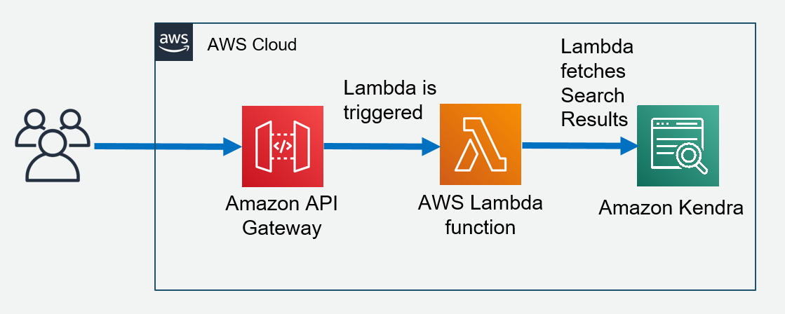

## Kendra Search Serverless web application using Amazon API Gateway & AWS Lambda
This project aims to help you provision a ready-to-use Webstack consisting of Aamzon API Gateway & AWS Lambda by simply running few CDK commands.




## Prerequisites
- [x] Create Kendra Index as per the [steps](https://docs.aws.amazon.com/kendra/latest/dg/create-index.html)
- [x] update lambda\kendraQuery.js with kendra index and the region it was created.

## Set up

```bash
npm install
```

## Available Scripts

### Deploy
 ```bash
cdk bootstrap
cdk deploy
```

## Security

See [CONTRIBUTING](CONTRIBUTING.md#security-issue-notifications) for more information.

## License

This library is licensed under the MIT-0 License. See the LICENSE file.

